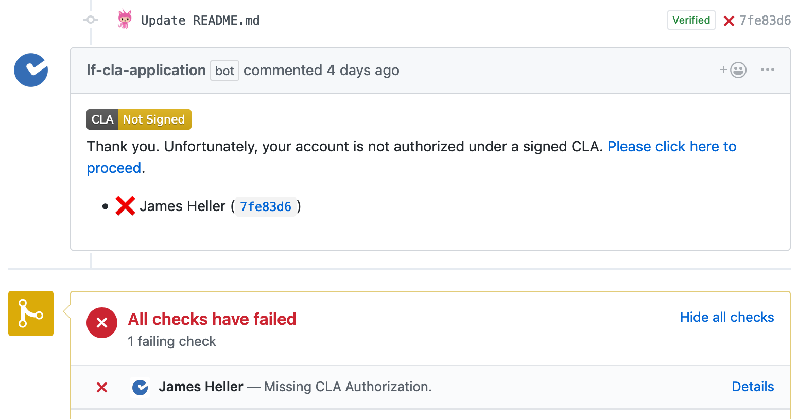
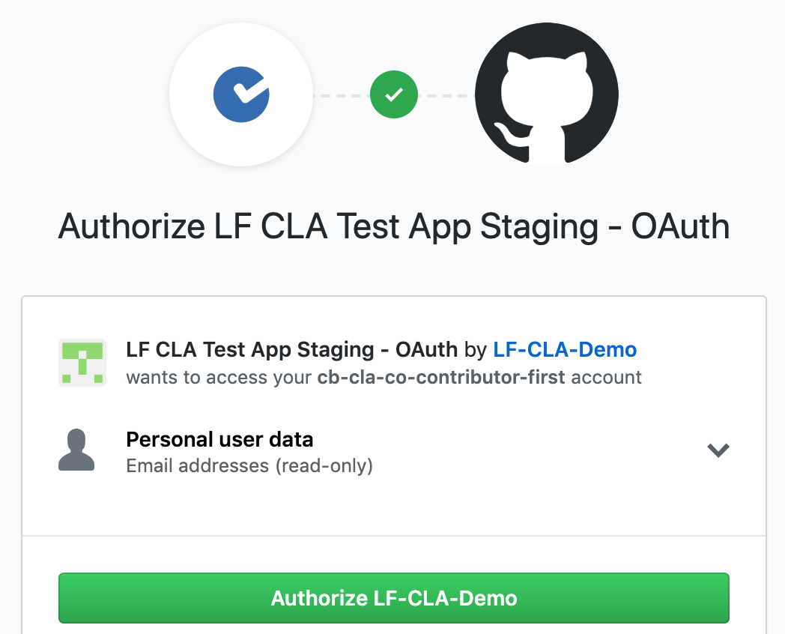
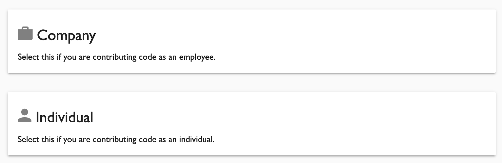
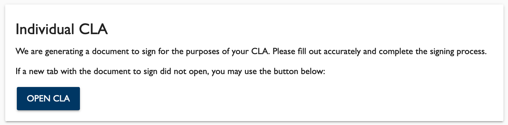
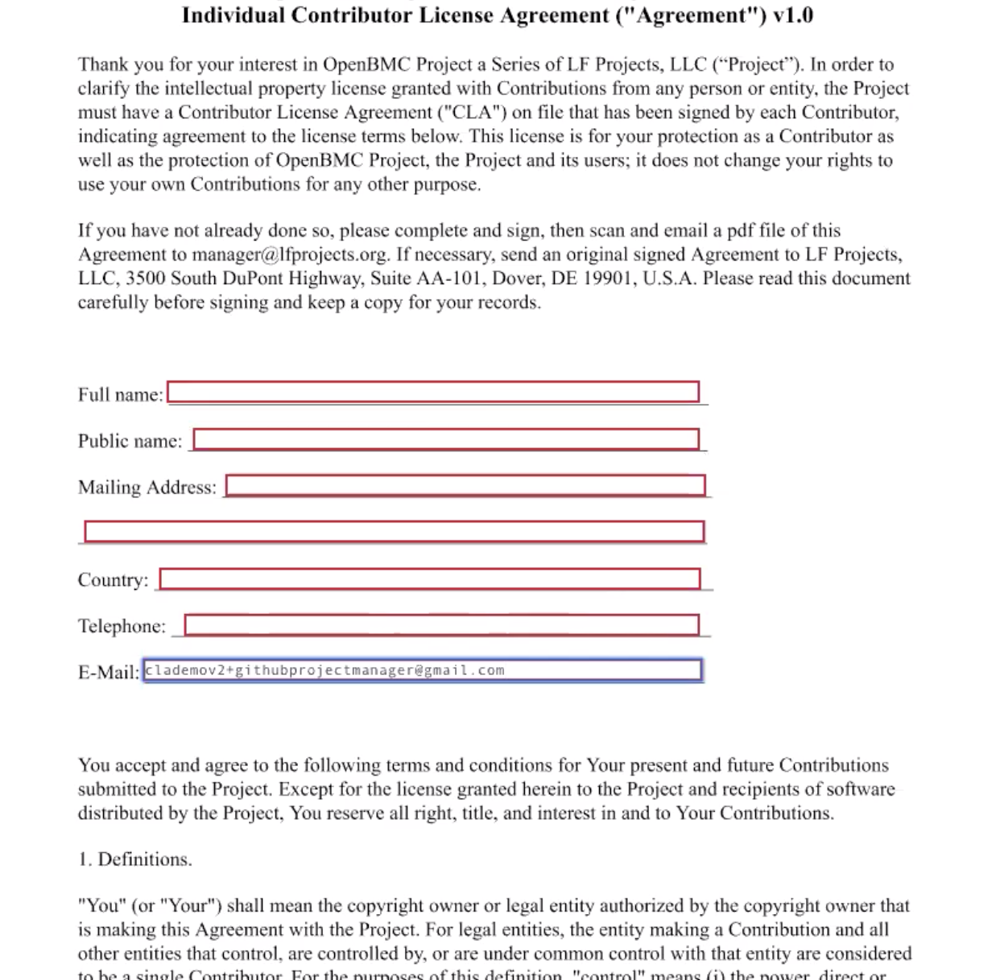
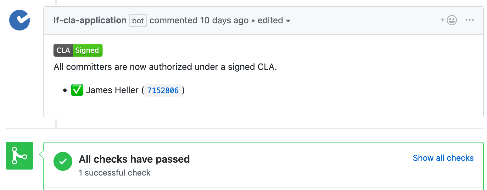

SPDX-License-Identifier: CC-BY-4.0

## CLA Tool Usage Example - Individual Contributor

### Scenario

You are a developer who wants to contribute source code to a Linux Foundation-hosted, GitHub-based project that uses the CLA Tool. You are contributing code that you wrote _on your own behalf_ (e.g., code that you wrote on your own time, and not for an employer or using your employer’s facilities or equipment).

### Caution

The following example workflow _does not apply_ if you are contributing code on behalf of your employer -- which can include, e.g., code that you wrote during work hours or using your employer’s equipment.

You should not submit a contribution under an Individual CLA, if that contribution consists of content that belongs to your company. Instead, you should contribute it under a Corporate CLA signed by your company. To see an example of using the CLA Tool for this:
* go [here](./3-Corporate-Contributor-first-for-company.md) for an example where your company is contributing to the project for the first time
* go here (_NOTE: not yet drafted_) for an example where your company has previously contributed to the project

### The Big Picture

Before the project can accept your contribution, the project community wants to ensure that you have signed an “Individual CLA.” This is a legal agreement that spells out the terms of your contribution, including specifically the scope of the license that is granted. Different projects may use different CLAs.

The CLA Tool ensures that the pull request is flagged as not ready to be merged, until you have signed an Individual CLA. If you do not already have one, you will need to create a Linux Foundation ID to use the CLA Tool. After you electronically sign an Individual CLA, then the GitHub account associated with your Linux Foundation ID will be marked as approved, and the CLA Tool’s check in the PR will now pass.

### Detailed Process

1. Submit a PR in GitHub to the project. If you have not signed an Individual CLA for this project, your contribution will be blocked with a message like the following:

2. Click on the link in the message to proceed to the CLA Contributor Console. You may be asked to authorize the CLA Tool to access your GitHub user information. Click on the green “Authorize” button to proceed:

3. In the CLA Contributor Console, you will be asked whether you are contributing on behalf of a company, or on your own behalf as an individual:

4. Click on “Individual”. A notice will be displayed that an individual CLA is being generated for you to sign. If the CLA does not open in a separate tab, click the “Open CLA” button:

5. You will be taken to a DocuSign window which displays the actual Individual CLA text, typically together with a few data fields for you to complete. Fill in the requested information and sign the CLA:

6. After you sign the Individual CLA, you will be returned to the GitHub PR. A message will now indicate that the CLA Tool checks have passed successfully. If this message does not display immediately, please wait a moment for the system to sync before refreshing the page.

7. When you subsequently submit PRs to this project, you should now see this message confirming that you are authorized under a signed CLA. You should not need to re-sign the Individual CLA for this project in the future.

### Troubleshooting

If you encounter problems or unexpected errors while using the CLA Tool, please contact the CLA administration team at docucla@linuxfoundation.org with questions.