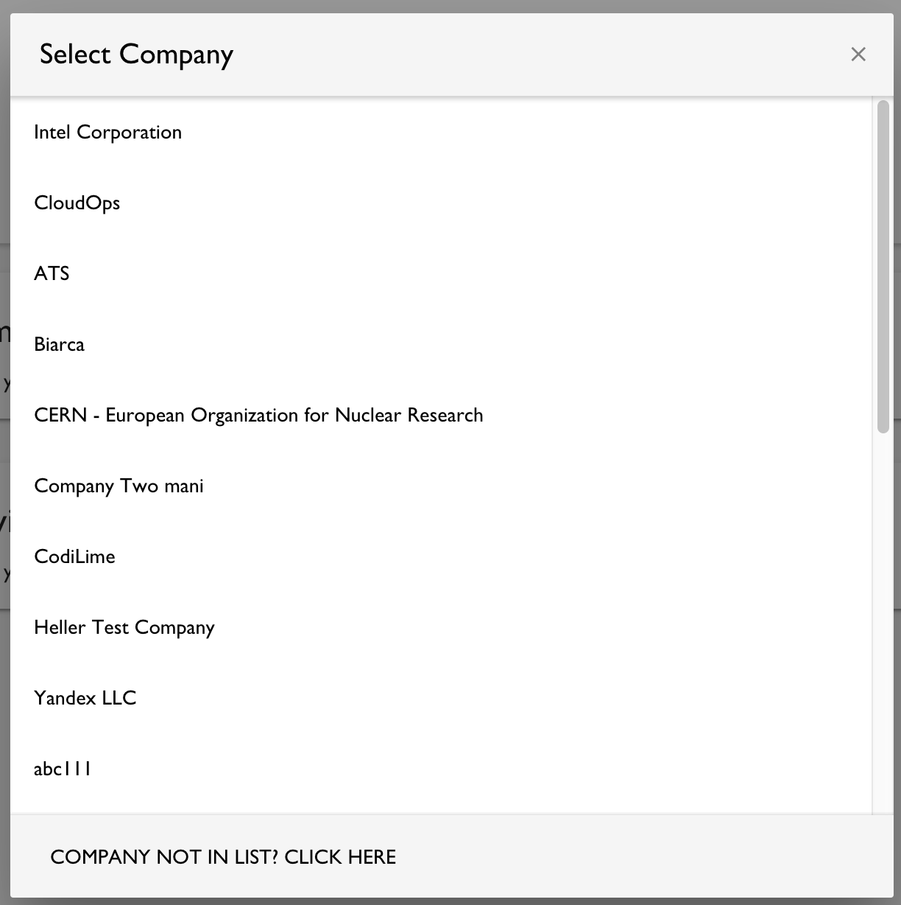
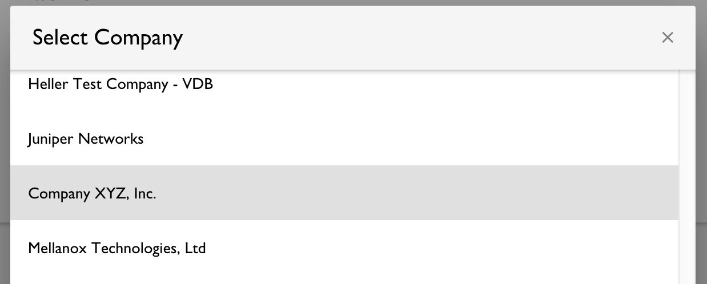

SPDX-License-Identifier: CC-BY-4.0

## CLA Tool Usage Example - Corporate Contributor, first time for company

### Scenario

You are a developer who wants to contribute source code to a Linux Foundation-hosted, GitHub-based project that uses the CLA Tool. You are contributing code that you wrote _for your employer_ and are contributing it to a project on its behalf. You are the first person from your employer to contribute to this project, so your employer will first need to sign a CLA for this project.

### Caution

The following example workflow does not apply if you are contributing code _on your own behalf_ as an individual, and not on behalf of an employer. Go [here](./1-Individual-Contributor.md) to see an example of using the CLA Tool to sign an Individual CLA, when you are contributing content that is owned by you (and not by your employer).

The following example workflow also assumes that your employer has not yet signed a CLA for this project. If other people from your company have already contributed to this project in the past, then your company likely has already signed a CLA. Go here (_NOTE: not yet drafted_) to see an example of the workflow for using the CLA Tool that assumes your employer has already signed a Corporate CLA for this project.

### The Big Picture

Before the project can accept your contribution, the project community wants to ensure that your company has signed a “Corporate CLA,” and that your company has authorized you to contribute to the project on their behalf. The Corporate CLA is a legal agreement that spells out the terms of your company’s contributions, including specifically the scope of the license that is granted. Different projects may use different CLAs.

The CLA Tool ensures that the pull request is flagged as not ready to be merged, until your company has (1) signed a Corporate CLA, and (2) “whitelisted” you as an authorized contributor under that signed Corporate CLA. If you do not already have one, you will need to create a Linux Foundation ID to use the CLA Tool. 

After the Corporate CLA has been signed by someone who is authorized to sign on behalf of your company, and your email address is whitelisted under that Corporate CLA, then the GitHub account associated with your Linux Foundation ID will be marked as approved, and the CLA Tool’s check in the PR will now pass.

### Before Getting Started

You will need to know who will be the **initial CLA Manager** from your company for this project.

Within the CLA Tool, CLA Managers are the individuals who are responsible for managing your company’s list of authorized contributors to this project. Because this is the first time your company is contributing to this project, the CLA Tool does not yet know who will be the first CLA Manager from your company. You may wish to consult with your company’s technical leadership to confirm who this should be. Depending on your company’s internal organization, you may be the person who should be the CLA Manager for this project.

You will need to provide their name and email address when following the steps below.

### Detailed Process

1. Submit a PR in GitHub to the project. Because your company has not yet signed a Corporate CLA for this project, your contribution will be blocked with a message like the following:

2. Click on the link in the message to proceed to the CLA Contributor Console. You may be asked to authorize the CLA Tool to access your GitHub user information. Click on the green “Authorize” button to proceed:

3. In the CLA Contributor Console, you will then be asked whether you are contributing on behalf of a company, or on your own behalf as an individual. Click on “Company”:

4. A dialog box will appear which lists the companies that have already signed a Corporate CLA for this project. Because this tutorial assumes that your company has not signed, click on the label at the bottom of the dialog which reads “Company not in list? Click here”:

5. A dialog box will now ask if you are the CLA Manager for your company for this project. (See “Before Getting Started” above for details about the CLA Manager role.) 

If you **will** be your company’s CLA Manager for this project, click “Yes” and you will be taken to the CLA Manager workflow (go [here](./4-CLA-Manager.md) for a tutorial that walks through the CLA Manager’s tasks; you will likely begin in Step 3 of that tutorial). 

If you **will not** be your company’s CLA Manager for this project, click “No” and continue to the next step.

6. You will now be asked to provide the name and email address of the CLA Manager, so that they can continue the CLA signup process. You will also be asked to select which of the email addresses linked to your GitHub account is the one that is associated with your work for your company:

7. After you fill in the requested information and click “Send,” a message will inform you that an email has been sent to the CLA Manager you designated. That individual will then proceed with the CLA Manager workflow, which includes getting the actual Corporate CLA signature. The CLA Manager will also need to add you to your company’s “whitelist” of approved contributors to the project.

8. After the CLA Manager completes their tasks, you will need to confirm your authorization to contribute in the CLA Contributor Console. Go back to your PR and repeat steps 1-3 above (you should not need to re-authorize the CLA Tool in step 2). In the dialog box with the list of companies that have signed a Corporate CLA for this project, select your company:

9. You will be shown a screen where you are asked to confirm that you are and remain affiliated with the company. Select the checkbox and click “Continue”:

10. Depending on this project’s settings, you may also be asked to sign an Individual CLA. This is intended to cover contributions that you might contribute from your GitHub account _on your own behalf_, rather than on behalf of your company. If required to do so, click to proceed and you will be taken to a DocuSign window which displays the actual Individual CLA text, typically together with a few data fields for you to complete. Fill in the requested information and sign the Individual CLA.

11. You will now be returned to the GitHub PR. A message will now indicate that the CLA Tool checks have passed successfully. If this message does not display immediately, please wait a moment for the system to sync before refreshing the page.

12. When you subsequently submit PRs to this project, you should now see this message confirming that you are authorized under a signed CLA. You should not need to re-authorize yourself under your company’s Corporate CLA, or re-sign an Individual CLA, for this project in the future.

### Troubleshooting

If you encounter problems or unexpected errors while using the CLA Tool, please contact the CLA administration team at docucla@linuxfoundation.org with questions.
