SPDX-License-Identifier: CC-BY-4.0

## CLA Tool Usage Example - CLA Manager

### Scenario

One or more developers (possibly including yourself) from your company want to contribute source code to a Linux Foundation-hosted, GitHub-based project that uses the CLA Tool. The code being contributing was written _for your company_ and is being contributed to a project on its behalf. 

This is the first time your company will be contributing to this project, so your company will first need to sign a CLA for this project. You, as your company’s CLA Manager for this project, will then be the person from your company who maintains the lists of people from your company who are authorized to contribute to the project under that CLA.

### Caution

The following example workflow does not apply to people contributing code _on their own behalf_ as individuals, and not on behalf of their employer. Go [here](./1-Individual-Contributor.md) to see an example of using the CLA Tool to sign an Individual CLA, when you are contributing content that is owned by you (and not by your employer).

The following example workflow also assumes that your employer has not yet signed a CLA for this project. If other people from your company have already contributed to this project in the past, then your company likely has already signed a CLA. Go here (_NOTE: not yet drafted_) to see an example of the workflow for using the CLA Tool that assumes your employer has already signed a Corporate CLA for this project.

### The Big Picture

You will typically begin the CLA Manager workflow for the first time when someone from your company attempts to contribute to the project. Their contribution will be blocked because they are not authorized to contribute under a Corporate CLA signed by your company.

Within the CLA Tool, the contributor will designate you as the initial CLA Manager from your company for this project. After they do so, you will need to coordinate getting a Corporate CLA for this project signed by a CLA Signatory from your company (see below). After that, you will need to “whitelist” the contributor’s email address -- and/or a broader set of email addresses that includes the contributor - so that they are confirmed as authorized to contribute to the project from your company. After that is completed, they will then be able to proceed with their contribution to the project.

### Before Getting Started

You will need to know who will be the **CLA Signatory** from your company for this project.

Within the CLA Tool, a CLA Signatory is the person from your company who is authorized by your company to sign contracts like CLAs on its behalf. Typically a CLA Signatory may be a member of your company’s leadership team. Depending on the size of your company and your role within it, you might or might not be authorized to be a CLA Signatory yourself. If you do not know for sure, you may need to consult with your company’s leadership or legal team.

You will need to provide the CLA Signatory’s name and email address when following the steps below.

### Detailed Process

1. You may have received an email from the CLA Tool, indicating that the contributor has designated you as the likely CLA Manager from your company for this project. Click the link at the bottom of the email to proceed:

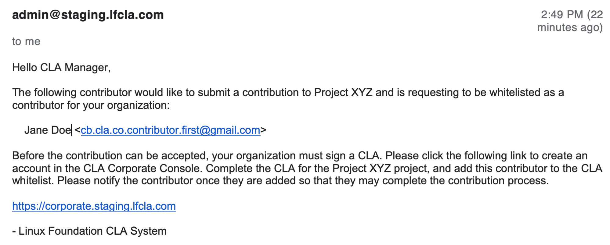

If you didn't receive this email, or are looking to have the Corporate CLA executed prior to your company’s first contribution to this project, you can go directly to https://corporate.lfcla.com. (Note that the URL in the above screenshot is from a demo server; https://corporate.lfcla.com is the correct URL you should use.)

2. You will need to sign into your Linux Foundation ID account. If you do not already have one, you will need to create one. You can sign in using a linked GitHub or Google account.

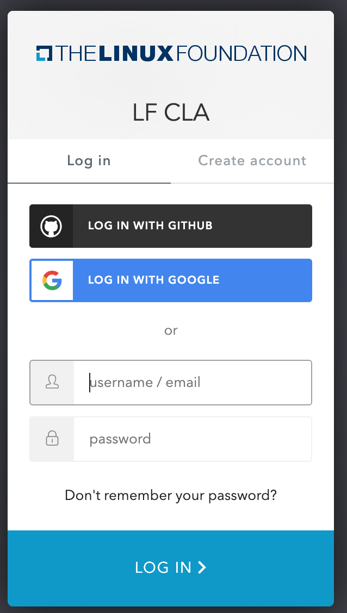

3. After you log into your Linux Foundation ID account (creating and verifying your email if required), you will be taken to the CLA Corporate Console. This will display the list of companies with which your account is associated. Click on the “Add Company” button:

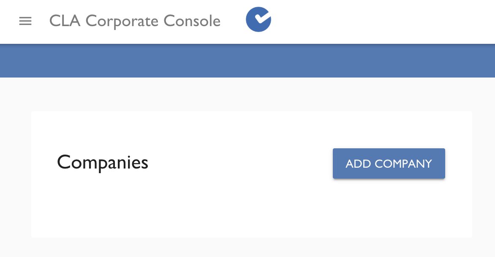

4. A dialog box will ask you to enter the name of your company, to register it with the CLA Tool. Enter the company’s name and click “Save”:

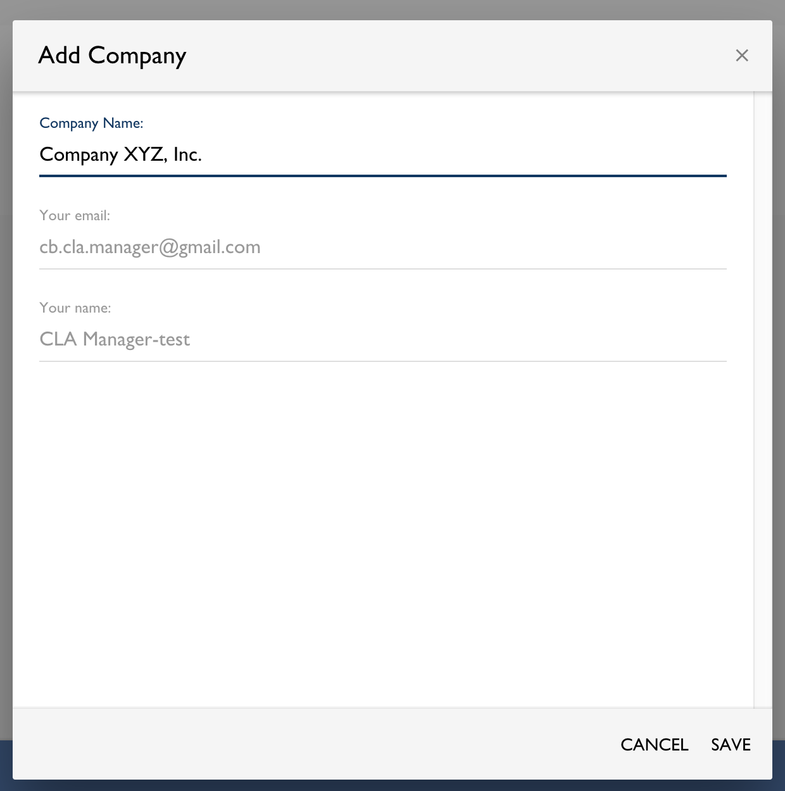

5. Your company will now be listed in the CLA Corporate Console for your account. Click on your company’s name in the Console:

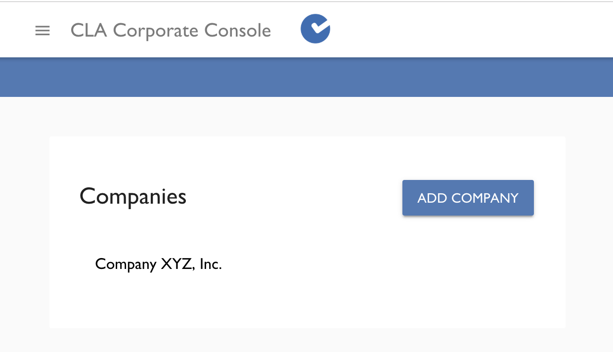

6. The Console will now show CLAs that your company has signed. Click the “New CLA” button to sign a CLA for this project (or to arrange for someone else from your company to sign it):

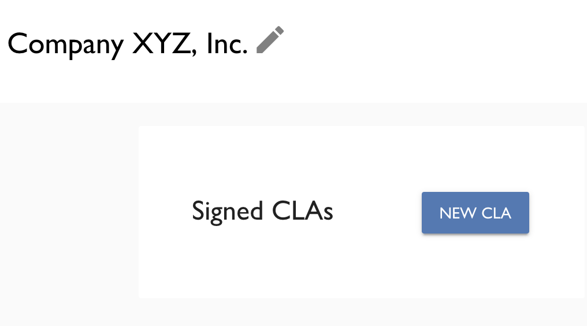

7. A dialog box will display the projects for which CLAs can be signed. Select the project that was mentioned in the email you received in Step 1:

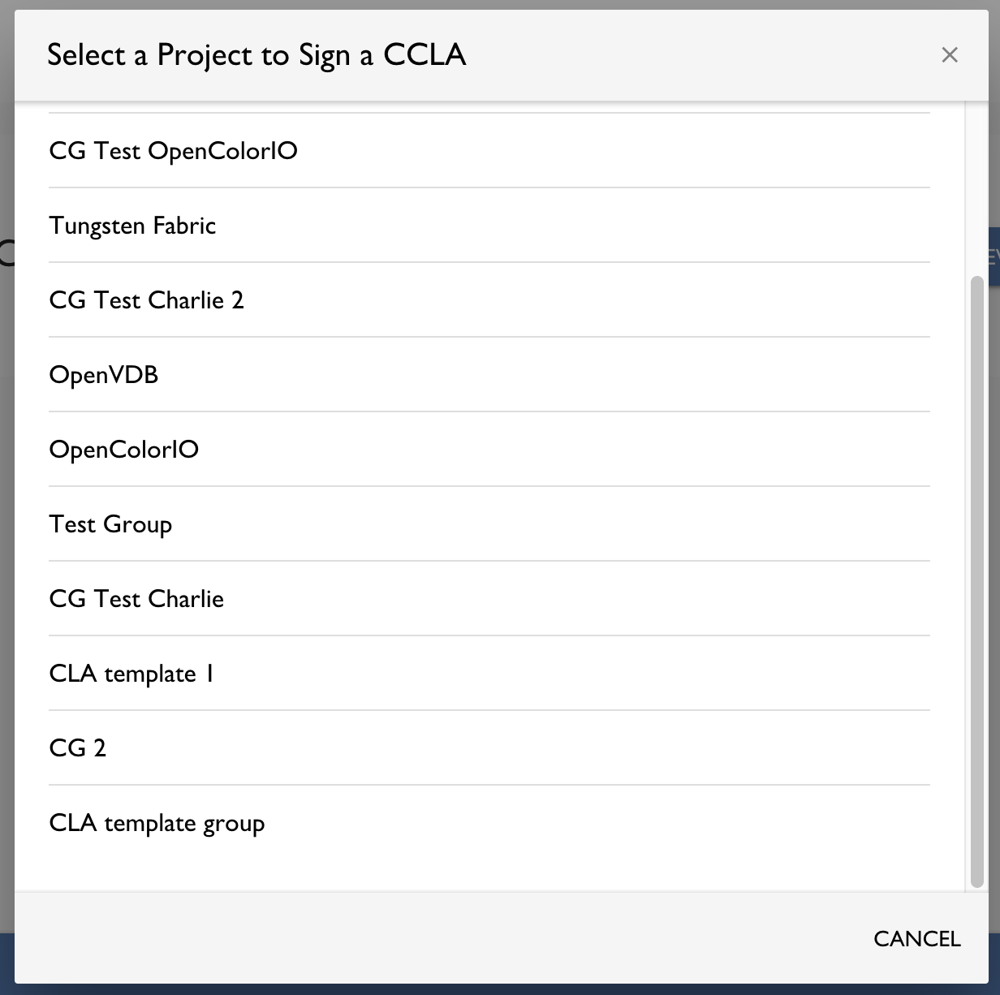

8. You will now be asked whether you are authorized to be a CLA Signatory for your company. (See “Before Getting Started” above for details about the CLA Signatory role.) 

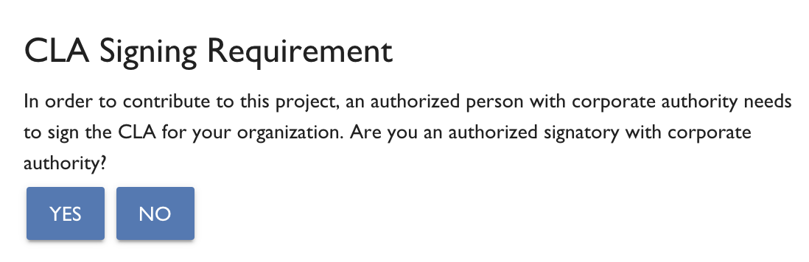

If you **are** an authorized signatory for your company, click “Yes” and you will be taken to a DocuSign window where you can electronically sign the Corporate CLA. After doing so, continue to Step 11 below.

If you **are not** an authorized signatory for your company, click “No” and continue to the next step.

9. You will now be asked to provide the name and email address of a person who is authorized to be a CLA Signatory for your company. (See “Before Getting Started” above for details about the CLA Signatory role.) Fill in the name and email address of the CLA Signatory for your company, and click “Send”:

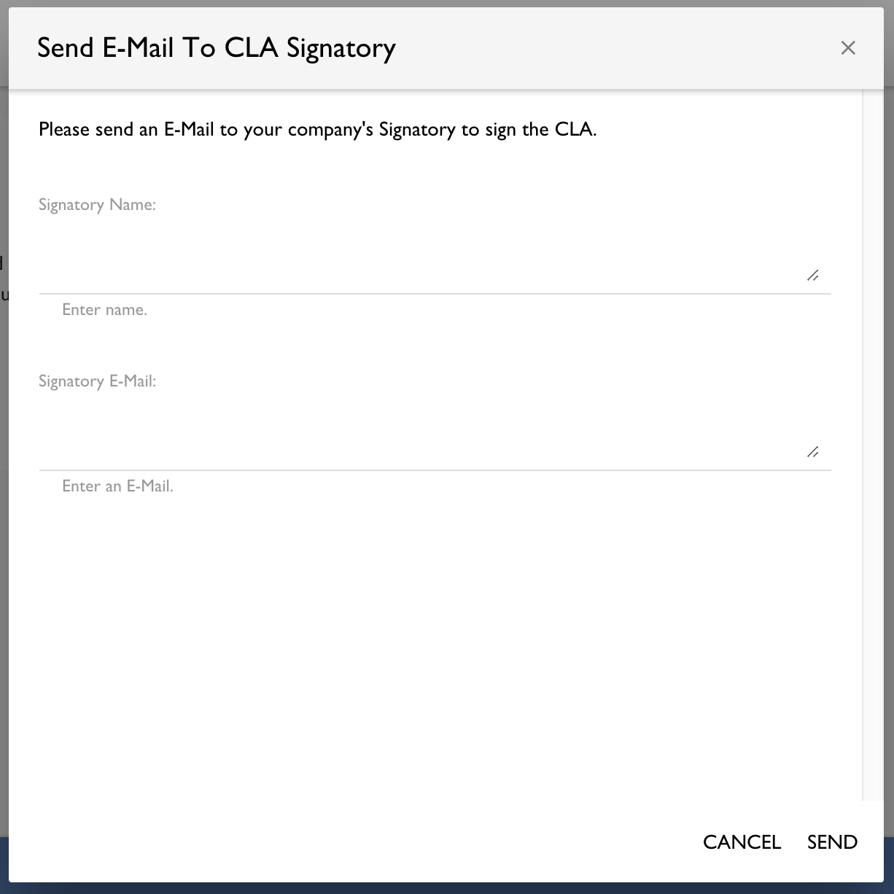

10. After you fill in the requested information and click “Send,” a message will inform you that an email has been sent to the CLA Signatory you designated. That individual will then receive an email asking them to electronically sign the Corporate CLA in DocuSign. You will want to coordinate with that person to ensure they sign the Corporate CLA.

11. After the CLA Signatory signs the Corporate CLA, it will now appear in the “Signed CLAs” list in your CLA Corporate Console window. If it does not immediately appear, please wait a moment for the system to sync before refreshing the page. After it appears, click on the name of the project:

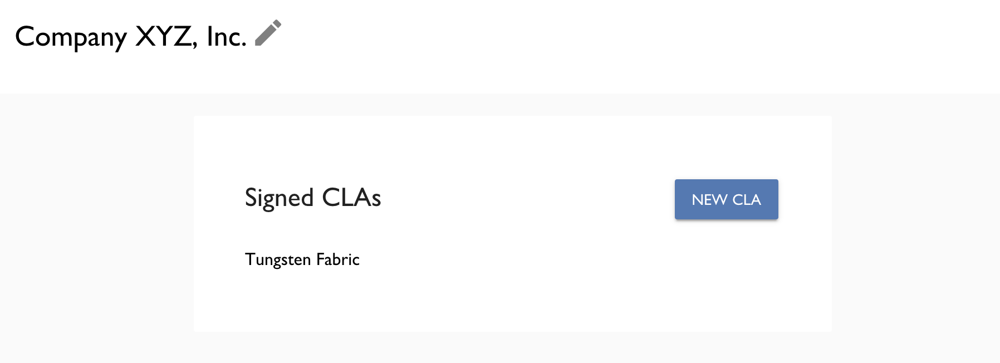

12. Now that the CLA has been signed, you will be able to manage the list of persons who are authorized to contribute to this project on behalf of your company. This screen shows the different options for “whitelisting” authorized contributors:

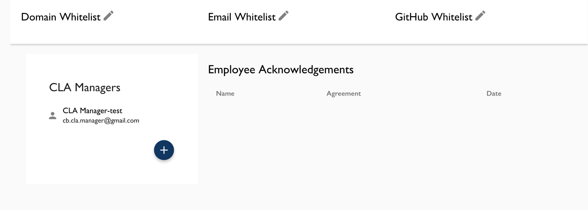

You can authorize contributors for this project by editing any of the following whitelists:

* **Domain Whitelist**: allows contributions to the project from all persons with an email address in the domain that you specify. _Take care when using this option, as all email addresses in the specified domain will be authorized._

* **Email Whitelist**: allows contributions to the project from the persons with the email addresses that you specify.

* **GitHub Whitelist**: allows contributions to the project from the persons with the GitHub usernames that you specify.

To edit a whitelist, click the pencil icon next to it. In the dialog box that appears, fill in the applicable details for the contributors you wish to authorize. You can add more rows by clicking the “Add” button, or remove a row by clicking the “X” button next to it. When you are done, click “Save”.

After you have added a contributor to a whitelist, you can notify them to proceed. They will still need to make an acknowledgement that they are authorized and remain affiliated with the company, before they can contribute. After they have done so, they will now be listed under the “Employee Acknowledgements” section of this screen, and they will now be able to contribute to the project.

13. From this window, you can also add persons as additional CLA Managers who are similarly enabled to manage the settings on this screen. To do so, click the “+” button under the “CLA Managers” section. Currently, to add another CLA Manager you will need to know their Linux Foundation ID (LFID) username. Please work with the person you wish to add, and you can contact docucla@linuxfoundation.org if you need assistance.

### Troubleshooting

If you encounter problems or unexpected errors while using the CLA Tool, please contact the CLA administration team at docucla@linuxfoundation.org with questions.
